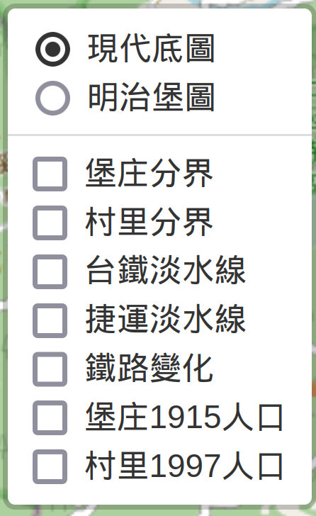
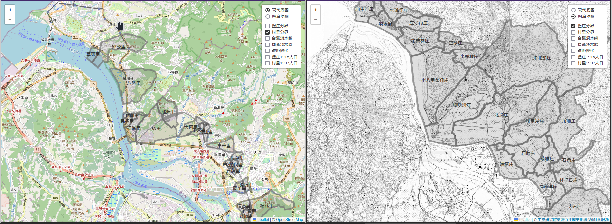
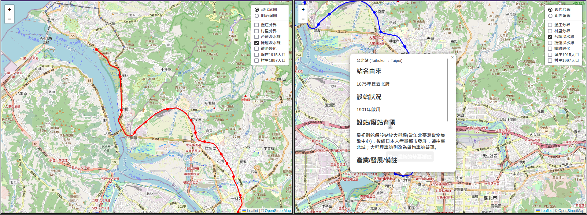
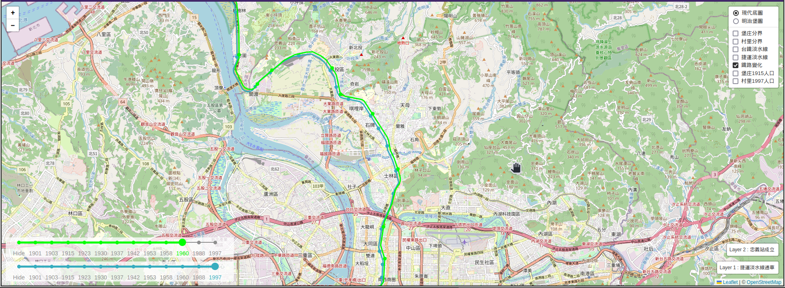
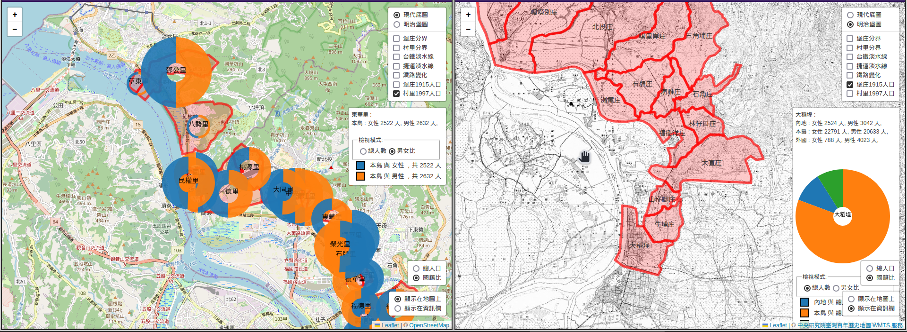

# 關於 HistoryOfTansuiRedline
111學年度第1學期 - 歷史研究數位人文資源的介紹與實作 (CSIE5025) 期末報告資料視覺化網頁

# 網址 : https://cycpe950609.github.io/HistoryOfTansuiRedline/

# 使用說明

我們提供2種底圖及7種疊圖。底圖分別是現代底圖及明治堡圖，作為後續疊圖位置的對照。而7種疊圖為：堡庄分界（西元1900年代台灣街庄階層的行政區劃分）、村里分界（西元1997年台北市、台北縣村里階層的行政區劃分）、台鐵淡水線（完整的台鐵鐵路及無論存廢的各站資料）、捷運淡水線（捷運淡水線由淡水站到台北車站區間各站資料）、堡庄1915人口（西元1915年第二次台灣臨時戶口調查）、村里1997人口（西元1998年人口資料） 

## 底圖 

現代底圖的圖資來自OpenStreetMap，明治堡圖圖資來自中研院臺灣百年歷史地圖之日治二萬分之一台灣堡圖（明治版） 

## 分界 

我們提供台鐵與捷運淡水線有通過的堡庄及村里的行政區分界。

左圖：OpenStreetMap與村里分界 右圖：明治版台灣堡圖與堡庄分界 

## 台鐵與捷運路線 

我們提供無論存廢的各站台鐵與捷運站資料 

左圖：捷運路線圖 右圖：台鐵路線圖，滑鼠移到車站標記上可觀看介紹 

## 歷史變化 

我們提供各個年份的鐵路與捷運變化，包含車站設站與廢站，該年度發生的事會顯示在右下角的資訊欄裡。第二層比較（綠色的鐵路）會位移一小段距離以方便比較，故路線及車站位置不在真正的座標上。 

## 人口比較 

提供人口顯示模式以、2種資料內容、2種比較的各分類比例之圓餅圖。顯示模式分別是直接顯示在地圖上或是顯示在資訊欄上，顯示在地圖上的模式還可根據圓餅圖直徑比較人口數差異。資料內容為總人口（各分類人口和）與國籍比（日治時期戶口調查分成3類）。2種比較則是總人數以及男女比，因為日治時期台灣臨時戶口調查將居民分成本島、內地及外國人，故總人數為將各分類的男女人數相加。 

 
